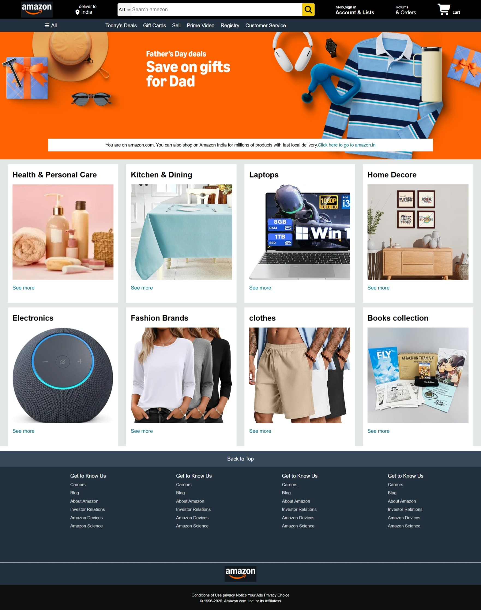

# amazon-inspired-clone-frontend

A responsive clone of the Amazon homepage built using **HTML5** and **CSS3**. This project recreates the front page layout of Amazon for frontend practice and to improve CSS layout skills.

## 📸 Preview

> Add a screenshot of the project here.



## 🚀 Features

- Amazon-inspired homepage UI
- Responsive navigation bar
- Hero banner section
- Product category cards
- Footer section
- Clean and organized HTML & CSS

## 🛠️ Technologies Used

- HTML5
- CSS3

## 📂 Project Structure

```
Amazon-inspired-Clone-frontend/
│── index.html
│── style.css
│── screenshot.png
│── amazon.png
│── amazon-home.jpeg
│── Box1 TO Box8
└── README.md
```

## ▶️ How to Run

1. Clone the repository:

```bash
git clone https://github.com/Pratik0006-hub/amazon-inspired-clone-frontend.git
```

2. Open the project folder.

3. Open `index1.html` in your browser.

## 🎯 Purpose

This project was built to practice:

- HTML page structure
- CSS Flexbox
- CSS Grid
- Responsive web design
- UI cloning

## 📌 Future Improvements

- Add JavaScript functionality
- Make the page fully responsive for all devices
- Add search bar interactions
- Create additional Amazon pages
- Integrate backend functionality

## 👨‍💻 Author

Pratik Gabhale

GitHub: https://github.com/Pratik0006-hub

---

**Note:** This project is created for educational purposes only and is not affiliated with Amazon.